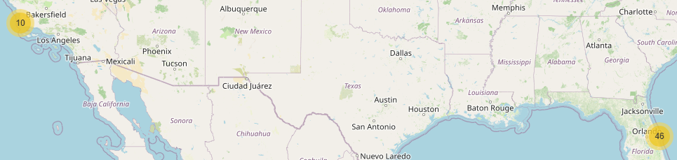
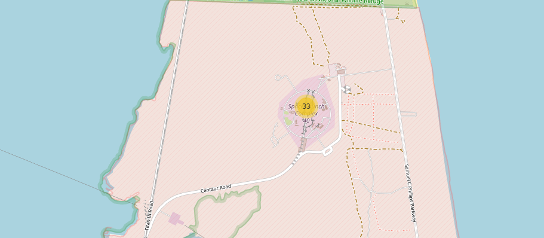
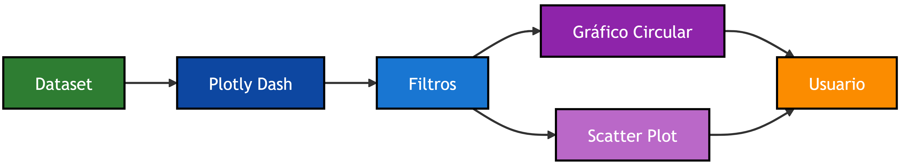
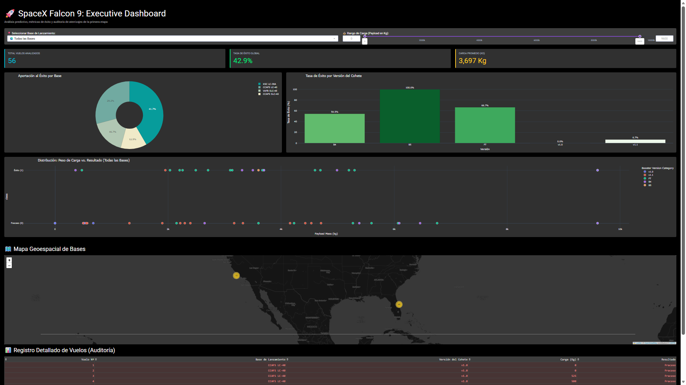
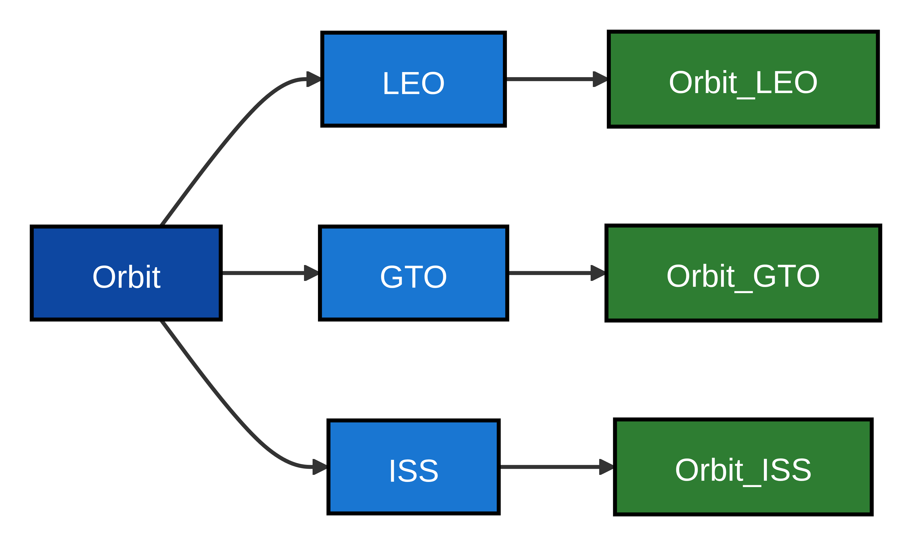
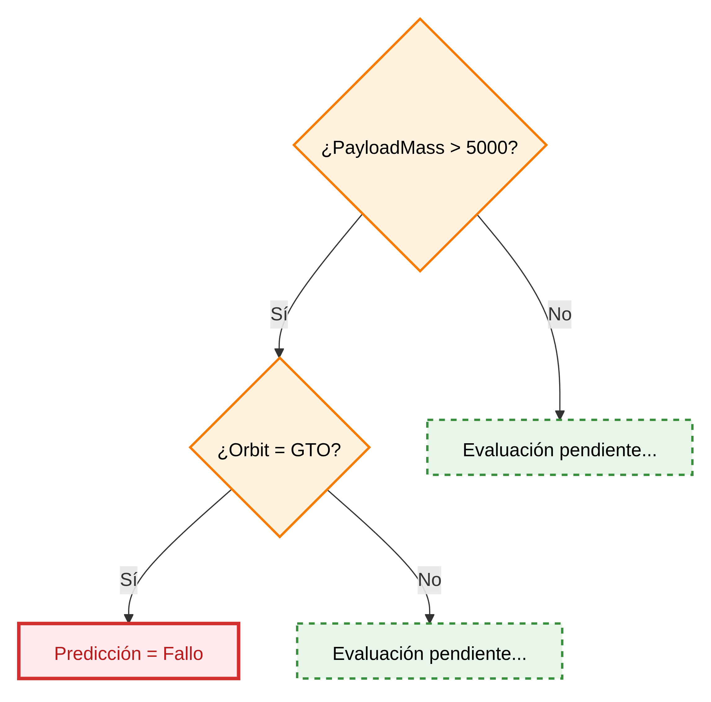
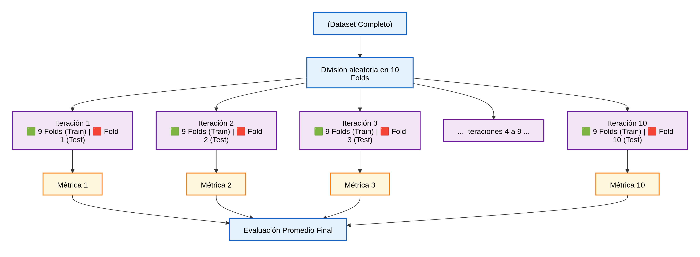

```{python}
#| label: setup
#| include: false

# Importamos las librerías necesarias para todo el proyecto
import pandas as pd
import sqlite3
from IPython.display import display, Markdown

# 3. Preparamos la base de datos SQL
con = sqlite3.connect("src/laboratorio/datasets/spacex.db")
```
\newpage

# Resumen Ejecutivo

La reutilización de la primera etapa del Falcon 9 ha transformado la industria aeroespacial al reducir significativamente los costes de acceso al espacio. Mientras que los lanzamientos tradicionales requieren la construcción de un nuevo vehículo para cada misión, *SpaceX* ha desarrollado un sistema capaz de recuperar, reacondicionar y reutilizar componentes críticos de sus cohetes. Esta capacidad constituye una de las principales ventajas competitivas de la compañía y uno de los factores que explican su liderazgo actual en el mercado de lanzamientos espaciales.

En este contexto, el presente proyecto tiene como objetivo analizar los factores que influyen en el éxito de la recuperación de la primera etapa del Falcon 9 y desarrollar modelos predictivos capaces de anticipar el resultado de futuros aterrizajes utilizando técnicas de Ciencia de Datos y Machine Learning.

Para alcanzar este objetivo se implementó un flujo de trabajo completo de análisis de datos. En primer lugar, se recopilaron datos históricos de lanzamientos mediante la API pública de SpaceX y técnicas de Web Scraping aplicadas a Wikipedia. Posteriormente, se realizó un proceso de limpieza y preparación de datos, corrigiendo valores faltantes, transformando variables y construyendo una variable objetivo binaria que identificara los aterrizajes exitosos y fallidos.

Una vez preparado el conjunto de datos, se llevó a cabo un Análisis Exploratorio de Datos (EDA) mediante visualizaciones estadísticas y consultas SQL. Este procedimiento permitió identificar relaciones significativas entre variables como la masa de la carga útil, la órbita objetivo, el número de vuelo y el centro de lanzamiento. Adicionalmente, se desarrollaron mapas interactivos con Folium y un dashboard analítico mediante Plotly Dash para explorar patrones geográficos y operacionales relacionados con las actividades de lanzamiento y recuperación.

Finalmente, se aplicaron técnicas de aprendizaje automático para construir modelos predictivos capaces de estimar la probabilidad de éxito de un aterrizaje. Se evaluaron distintos algoritmos de clasificación, entre ellos Regresión Logística, Máquinas de Vectores de Soporte (SVM), Árboles de Decisión y K-Nearest Neighbors (KNN), utilizando validación cruzada y optimización de hiperparámetros mediante GridSearchCV.

Los resultados obtenidos permitieron identificar varios factores críticos para el éxito de las recuperaciones. En primer lugar, se observó que la experiencia acumulada por *SpaceX* constituye una de las variables más influyentes, mostrando una mejora progresiva en las tasas de recuperación conforme aumenta el número de lanzamientos realizados. Asimismo, la masa de la carga útil y el tipo de órbita mostraron una relación directa con la complejidad de las maniobras de aterrizaje. Las misiones con cargas medias dirigidas a órbitas bajas presentaron los mayores porcentajes de éxito, mientras que las misiones energéticamente más exigentes registraron una mayor probabilidad de fallo.

El análisis geoespacial reveló además que las bases de lanzamiento se encuentran estratégicamente ubicadas en zonas costeras con acceso a importantes infraestructuras logísticas, respondiendo simultáneamente a criterios de seguridad, eficiencia operativa y facilidad de transporte de componentes aeroespaciales. Entre todas las instalaciones analizadas, el complejo KSC LC-39A destacó como la plataforma con los mejores resultados operativos.

Desde el punto de vista predictivo, los modelos desarrollados alcanzaron una precisión aproximada del 83,3 % sobre datos no utilizados durante el entrenamiento. Este resultado demuestra que las variables seleccionadas contienen información suficiente para modelar de forma efectiva el comportamiento de las recuperaciones y anticipar futuros resultados con un elevado grado de confianza.

En conjunto, este proyecto demuestra cómo la aplicación de técnicas de Ciencia de Datos, análisis estadístico, inteligencia geoespacial y Machine Learning permite transformar datos históricos en conocimiento accionable, proporcionando una comprensión más profunda de los factores que intervienen en la reutilización de cohetes y evidenciando el valor estratégico de los datos dentro de la industria aeroespacial moderna.

## Principales hallazgos
- La experiencia acumulada por *SpaceX* es el principal factor asociado al éxito de los aterrizajes.
- La masa de la carga útil influye significativamente en la probabilidad de recuperación.
- El tipo de órbita condiciona el nivel de dificultad de cada misión.
- KSC LC-39A presenta los mejores indicadores históricos de rendimiento.
- Las instalaciones de lanzamiento responden a criterios combinados de seguridad y optimización logística.
- Los modelos de Machine Learning alcanzaron una precisión cercana al 83,3 % en la predicción de aterrizajes exitosos.
- La Ciencia de Datos constituye una herramienta eficaz para el análisis y la optimización de operaciones aeroespaciales complejas.

\newpage

# Recolección de Datos (Data Collection)

La calidad de cualquier proyecto de Ciencia de Datos depende directamente de la calidad de los datos utilizados. Por este motivo, la primera fase del proyecto se centró en la identificación, adquisición y validación de fuentes de información fiables relacionadas con los lanzamientos del Falcon 9.

El objetivo principal de esta etapa consistió en construir un conjunto de datos suficientemente completo para describir las características técnicas de cada misión, las condiciones operativas del lanzamiento y los resultados de recuperación de la primera etapa.

Para minimizar errores y aumentar la fiabilidad de la información, se utilizaron dos fuentes independientes:

- API pública de *SpaceX*. 
- Información histórica obtenida mediante Web Scraping desde Wikipedia.

La combinación de ambas fuentes permitió contrastar información y enriquecer el conjunto final de datos.

## Arquitectura de adquisición de datos

Antes de comenzar la extracción, se diseñó un flujo de adquisición capaz de integrar múltiples fuentes de información.

{width="600"}

## Obtención de datos desde la API de SpaceX

La fuente principal de información fue la API pública de *SpaceX*, una interfaz REST que proporciona acceso directo a la información oficial de lanzamientos, vehículos, cargas útiles y plataformas de lanzamiento.

Las API REST constituyen uno de los mecanismos más utilizados para el intercambio de datos entre aplicaciones modernas debido a su simplicidad, escalabilidad y facilidad de integración.

En este proyecto, cada petición HTTP devolvía la información en formato JSON, permitiendo su procesamiento automático mediante Python.

*Ventajas de utilizar la API*

- Información oficial y actualizada.
- Formato estructurado.
- Acceso automatizable.
- Alta consistencia de datos.
- Fácil integración con Pandas.
- Proceso de extracción

*El procedimiento seguido fue:*

1.  Realizar una llamada HTTP.
2.  Descargar la respuesta JSON.
3.  Convertir la respuesta en un DataFrame.
4.  Filtrar únicamente lanzamientos Falcon 9.
5.  Seleccionar atributos relevantes.
6.  Almacenar los resultados para el análisis posterior.

{width="600"}

``` {.python filename="Conexión a la API de SpaceX"}
import requests
import pandas as pd
url = "https://api.spacexdata.com/v4/launches/past"
response = requests.get(url)
data = response.json()
df_launches = pd.json_normalize(data)
df_launches.head()
```

## Formato JSON devuelto por la API

La información recibida desde la API se encuentra estructurada en formato JSON.
Cada registro representa un lanzamiento individual e incluye decenas de atributos relacionados con la misión.

``` {.json filename="Ejemplo simplificado de respuesta JSON"}
{
  "name": "Starlink-15",
  "date_utc": "2020-10-24",
  "success": true,
  "rocket": "5e9d0d95eda69973a809d1ec",
  "payloads": [
    "5fbfedfe54ceb10a5664c80b"
  ]
}
```

## Variables obtenidas inicialmente

Durante la extracción se recuperaron numerosas variables. Sin embargo, no todas eran relevantes para la predicción del aterrizaje. Las variables seleccionadas inicialmente fueron las siguientes:

| Variable | Descripción |
|---|---|
| FlightNumber | Número de vuelo |
| Date | Fecha del lanzamiento |
| Rocket | Tipo de cohete |
| PayloadMass | Masa de carga útil |
| Orbit | Órbita destino |
| LaunchSite | Complejo de lanzamiento |
| Outcome | Resultado del aterrizaje |
| Flights | Historial operativo |

: Diccionario completo de variables.

## Obtención de datos mediante Web Scraping

Aunque la API proporciona gran cantidad de información, algunos atributos históricos aparecían incompletos o resultaban más fáciles de obtener desde Wikipedia.
Para complementar la información, se utilizó la técnica denominada Web Scraping.
Este procedimiento consiste en descargar automáticamente el contenido HTML de una página web y extraer únicamente los elementos relevantes.
La librería seleccionada fue BeautifulSoup debido a su sencillez y amplia adopción dentro del ecosistema Python.

{width="600"}

```{.python filename="Descarga del contenido HTML"}
import requests from bs4 import BeautifulSoup
url = wikipedia_url
html = requests.get(url)
soup = BeautifulSoup(html.text, "html.parser")
```


```{.python filename="Extracción de tablas"}
tables = pd.read_html(str(soup))
launch_table = tables\[0\]
launch_table.head()
```

## Validación de la calidad de los datos

Una vez obtenidas ambas fuentes se realizó un proceso de validación.

Las comprobaciones incluyeron:

- Búsqueda de registros duplicados. 
- Verificación de fechas.
- Detección de valores nulos. 
- Validación de tipos de datos.
- Comprobación de consistencia entre fuentes. 

## Limitaciones encontradas

Durante la adquisición aparecieron varias limitaciones:

- Campos incompletos en determinadas misiones históricas. 
- Cambios en la estructura de algunas tablas de Wikipedia. 
- Diferencias de nomenclatura entre fuentes.
- Valores ausentes en masas de carga útil.

Estas incidencias fueron resueltas posteriormente durante la fase de Data Wrangling.

## Resultado de la fase

Como resultado de esta etapa se obtuvo un conjunto consolidado de datos preparado para ser transformado y analizado.

| Métrica | Valor |
|---|---|
| Número de lanzamientos | 121 |
| Variables originales | 7 |
| Variables seleccionadas | 11 |
| Valores nulos detectados | 53 |
| Fuentes empleadas | API + Wikipedia |

: Resumen del dataset obtenido


# Limpieza de Datos (Data Wrangling)

## Justificación de la fase de Data Wrangling

La calidad de un modelo predictivo depende directamente de la calidad de los datos utilizados durante su entrenamiento. Por este motivo, antes de iniciar cualquier análisis exploratorio o proceso de Machine Learning, fue necesario realizar una fase exhaustiva de preparación y transformación de los datos.

Los conjuntos de datos obtenidos desde la API de *SpaceX* y mediante técnicas de Web Scraping presentaban valores faltantes, formatos heterogéneos y variables que debían ser adaptadas para su posterior procesamiento analítico. El objetivo principal de esta etapa fue construir un conjunto de datos consistente, fiable y adecuado para técnicas de aprendizaje supervisado.

## Integración de fuentes de información

Los datos procedentes de las distintas fuentes fueron consolidados en un único conjunto estructurado. Durante este proceso se verificó la correspondencia entre:

- Identificadores de misión.
- Fechas de lanzamiento.
- Centros de lanzamiento.
- Información de cargas útiles.
- Resultados de recuperación.

La integración permitió disponer de una visión unificada de cada misión del Falcon 9.

## Tratamiento de valores faltantes

Uno de los principales problemas detectados fue la existencia de registros incompletos, especialmente en variables relacionadas con la masa de carga útil (PayloadMass).

Para minimizar la pérdida de información se aplicaron técnicas de imputación. En aquellos casos donde la ausencia de datos no permitía una recuperación fiable de la información original, se utilizaron valores promedio calculados sobre observaciones equivalentes.

{width="600"}

## Ingeniería de características

Además de la limpieza de datos, se crearon nuevas variables destinadas a mejorar la capacidad predictiva de los modelos.

Entre las transformaciones realizadas destacan:

- Conversión de fechas a formato estándar.
- Extracción de variables temporales.
- Normalización de nombres de plataformas.
- Agrupación de categorías similares.
- Conversión de variables categóricas a formato utilizable por algoritmos de Machine Learning.

Estas transformaciones permitieron extraer información adicional sin necesidad de recopilar nuevas fuentes de datos.

## Construcción de la variable objetivo

El proceso más importante de esta fase consistió en definir la variable dependiente utilizada por los algoritmos de clasificación.

A partir de los diferentes estados registrados para los aterrizajes del Falcon 9 se construyó la variable binaria *Class*:

| Resultado del aterrizaje | Valor |
|---|---|
| Aterrizaje exitoso | 1 |
| Aterrizaje fallido | 0 |

Esta simplificación convirtió el problema en una tarea de clasificación binaria supervisada.

## Distribución de clases

Una vez creada la variable objetivo, se verificó el equilibrio entre observaciones exitosas y fallidas.

El análisis reveló una mayor proporción de aterrizajes exitosos en los años más recientes, reflejando la madurez tecnológica alcanzada por *SpaceX* y anticipando uno de los principales hallazgos identificados posteriormente durante el análisis exploratorio.

## Validación del conjunto de datos final

Antes de continuar con las fases de Exploratory Data Analysis (EDA) y Machine Learning, se realizaron diversas verificaciones de calidad:

- Comprobación de valores nulos residuales.
- Validación de tipos de datos.
- Eliminación de registros duplicados.
- Verificación de consistencia temporal.
- Revisión de rangos válidos para variables numéricas.

Como resultado, se obtuvo un conjunto de datos limpio, estructurado y preparado para las etapas posteriores de análisis estadístico y modelado predictivo.

## Resultado de la fase

La etapa de Data Wrangling permitió transformar datos heterogéneos procedentes de múltiples fuentes en un dataset analítico listo para explotación. Esta fase constituyó el fundamento sobre el que se construyeron todas las visualizaciones, consultas SQL, análisis geoespaciales y modelos predictivos desarrollados en el proyecto.

# Exploración de Datos (EDA)

## Objetivos del análisis exploratorio

Una vez completada la fase de preparación de datos, el siguiente paso consistió en comprender el comportamiento de las variables antes de construir modelos predictivos.

El Análisis Exploratorio de Datos (EDA) tiene como objetivo identificar patrones, tendencias, anomalías y relaciones entre variables mediante técnicas estadísticas y representaciones visuales.

En el contexto de este proyecto, el EDA persigue responder las siguientes preguntas:

- ¿Ha mejorado *SpaceX* con el paso del tiempo?
- ¿Influye la masa de la carga útil en el aterrizaje?
- ¿Existen diferencias entre plataformas de lanzamiento?
- ¿Algunas órbitas presentan más éxito que otras?
- ¿Qué variables parecen tener mayor capacidad predictiva?

## Metodología de análisis

El análisis visual se desarrolló empleando principalmente:

```
Pandas
NumPy
Matplotlib
Seaborn
```

Estas herramientas permiten representar distribuciones, tendencias temporales y relaciones entre variables de forma intuitiva.

{width="600"}

## Relación entre experiencia operativa y éxito

Una de las hipótesis iniciales del estudio era que la experiencia acumulada por *SpaceX* influiría positivamente en la probabilidad de recuperación.

Para comprobarlo se analizó la relación entre:

- Número de vuelo (Flight Number).
- Resultado del aterrizaje (Class).




### Interpretación

El gráfico muestra una tendencia clara: los primeros vuelos presentan una mayor concentración de fallos, mientras que las misiones más recientes exhiben porcentajes significativamente más altos de éxito.

Este comportamiento refleja el fenómeno conocido como learning curve o curva de aprendizaje.

Cada lanzamiento proporciona información operativa adicional que permite mejorar:

- Procedimientos de recuperación.
- Sistemas de guiado.
- Algoritmos de control.
- Maniobras de aterrizaje.

Desde una perspectiva empresarial, este resultado evidencia cómo la acumulación de conocimiento técnico genera ventajas competitivas sostenibles.

### Conclusión parcial

La experiencia operacional aparece como una de las variables más relevantes para explicar el éxito de los aterrizajes.

## Análisis de la masa de carga útil

La masa transportada constituye uno de los factores más importantes dentro de una misión espacial.

Cuanto mayor es la carga útil transportada:

- Mayor combustible es necesario.
- Menor margen energético queda disponible.
- Más complejas resultan las maniobras de recuperación.

Por este motivo se analizó la relación entre:

- PayloadMass.
- Resultados de aterrizaje.



### Interpretación

Los resultados muestran que las cargas extremadamente elevadas presentan una mayor dispersión de resultados y concentran una proporción más elevada de fallos.

Por el contrario, las cargas medias suelen asociarse a porcentajes de éxito más consistentes.

Esto puede explicarse porque la primera etapa dispone de mayores reservas energéticas para realizar maniobras de frenado y posicionamiento cuando la misión exige menores esfuerzos propulsivos.

### Conclusión parcial

La masa de la carga útil parece ejercer una influencia significativa sobre el resultado final del aterrizaje.

## Influencia del complejo de lanzamiento

*SpaceX* opera distintos complejos de lanzamiento.

Cada instalación presenta características específicas relacionadas con:

- Infraestructura disponible.
- Tipo de misión.
- Frecuencia de uso.
- Ubicación geográfica.

El objetivo de este análisis es determinar si existen diferencias de rendimiento entre complejos.



### Instalaciones analizadas

**CCAFS SLC-40**

Complejo histórico ubicado en Cabo Cañaveral.
Ha soportado un elevado número de lanzamientos comerciales y gubernamentales.

**KSC LC-39A**

Instalación originalmente utilizada por los programas Apollo y Space Shuttle.
Actualmente constituye una de las plataformas más importantes para *SpaceX*.

**VAFB SLC-4E**

Complejo situado en California destinado principalmente a órbitas polares.

### Interpretación

El análisis evidencia diferencias significativas entre instalaciones.

El complejo KSC LC-39A presenta el porcentaje de éxito más elevado, lo que puede explicarse por:

- Madurez operativa.
- Infraestructura más moderna.
- Concentración de misiones recientes.

### Conclusión parcial

La localización del lanzamiento constituye una variable relevante dentro del análisis predictivo.

## Relación entre órbita y recuperación

La órbita destino condiciona directamente el perfil de misión.

Algunas órbitas requieren:

- Mayor velocidad.
- Más combustible.
- Trayectorias más exigentes.

Estas condiciones afectan directamente la capacidad de recuperación de la primera etapa.



### Órbitas principales

**LEO (Low Earth Orbit)**

Órbita terrestre baja.

**ISS**

Misiones de suministro a la Estación Espacial Internacional.

**GTO (Geostationary Transfer Orbit)**

Misiones de alta exigencia energética.

**Polar y SSO**

Órbitas utilizadas principalmente para satélites de observación terrestre.

### Interpretación

Las órbitas de transferencia geoestacionaria presentan mayores dificultades de recuperación debido a la energía necesaria para alcanzar la trayectoria requerida.

Por el contrario, las misiones dirigidas a órbitas bajas suelen ofrecer mejores probabilidades de recuperación.

### Conclusión parcial

El tipo de órbita constituye uno de los predictores operativos más importantes del proyecto.

## Evolución histórica de la tasa de éxito

Además de analizar variables individuales, resulta importante comprender cómo ha evolucionado el programa de recuperación a lo largo del tiempo.



### Interpretación

La evolución temporal revela una mejora sostenida durante toda la década analizada.

Los primeros años muestran tasas reducidas de recuperación, mientras que los ejercicios más recientes alcanzan porcentajes cercanos al éxito sistemático.

Este resultado confirma el extraordinario progreso tecnológico logrado por *SpaceX* en un periodo relativamente corto.

## Hallazgo principal del EDA

Tras completar el análisis exploratorio, se identifican cuatro variables especialmente relevantes:

1. Número de vuelo.
2. Masa de carga útil.
3. Tipo de órbita.
4. Plataforma de lanzamiento.

Estas variables muestran relaciones claras con el resultado de la recuperación y justifican su utilización posterior en los modelos de Machine Learning.

## Transición hacia la siguiente fase

El análisis exploratorio permitió identificar patrones visuales de interés. Sin embargo, para validar cuantitativamente estas observaciones fue necesario complementar el estudio mediante consultas estructuradas utilizando SQL, tema que se aborda en el capítulo siguiente.


# Análisis de Datos mediante SQL

## Objetivo de la fase

Aunque las visualizaciones permiten identificar tendencias rápidamente, en muchos casos resulta necesario obtener respuestas exactas a preguntas concretas. Para ello se utilizó SQL (**Structured Query Language**), uno de los lenguajes más utilizados en entornos empresariales para consultar, transformar y analizar información almacenada en bases de datos.

Con el fin de facilitar este análisis, el conjunto de datos fue cargado en una base de datos SQLite denominada ```spacex.db```. Esto permitió realizar consultas complejas de forma eficiente y reproducible.

## Preparación de la base de datos

Antes de ejecutar las consultas, el conjunto de datos fue almacenado en una tabla denominada SPACEXTABLE.

```{.python filename="Conexión a la DB"}
import sqlite3
import prettytable

prettytable.DEFAULT = "DEFAULT"
con = sqlite3.connect("my_data1.db")
cur = con.cursor()
```

## ¿Qué sitios de lanzamiento utiliza SpaceX?

La primera consulta tuvo como objetivo identificar todas las instalaciones utilizadas por *SpaceX* durante el periodo analizado.
```{.sql filename="Consulta 1"}
SELECT DISTINCT Launch_Site
FROM SPACEXTABLE;
```


```{python}
q1 = pd.read_sql_query("SELECT DISTINCT Launch_Site as 'Sitios Únicos' FROM SPACEXTABLE;", con)
display(Markdown("**Bases de Lanzamiento Únicas:**"))
display(Markdown(q1.to_markdown(index=False)))
```

### Interpretación

El análisis confirma que la actividad operacional del Falcon 9 se concentra en un número relativamente reducido de instalaciones.

Esto refleja una estrategia de estandarización operativa que facilita:

- Reducción de costes.
- Optimización logística.
- Reutilización de infraestructuras.
- Simplificación de procesos de mantenimiento.

## ¿Cuál ha sido la contribución de SpaceX a las misiones de la NASA?

La NASA constituye uno de los principales clientes institucionales de *SpaceX*.

Para cuantificar esta relación se calculó la masa total transportada para dicha organización.

```{.sql filename="Consulta 2"}
SELECT SUM(PAYLOAD_MASS__KG_)
FROM SPACEXTABLE
WHERE CUSTOMER = 'NASA (CRS)';
```

```{python}
q2 = pd.read_sql_query("SELECT SUM(PAYLOAD_MASS__KG_) as 'Peso Total NASA (kg)' FROM SPACEXTABLE WHERE Customer LIKE '%NASA%';", con)
display(Markdown("**Peso total transportado para la NASA:**"))
display(Markdown(q2.to_markdown(index=False)))
```

### Interpretación

El resultado muestra la importancia estratégica de los contratos firmados entre *SpaceX* y la *NASA*.

Además de generar ingresos recurrentes, estas misiones han servido como plataforma de validación tecnológica para los sistemas de recuperación y reutilización.

## Capacidad de carga del Falcon 9 v1.1

Una de las preguntas más relevantes desde el punto de vista técnico consiste en determinar la capacidad operativa de las distintas versiones del Falcon 9.

``` {.sql filename="Consulta 3"}
SELECT AVG(PAYLOAD_MASS__KG_)
FROM SPACEXTABLE
WHERE BOOSTER_VERSION = 'F9 v1.1';
```

```{python}
q3 = pd.read_sql_query("SELECT AVG(PAYLOAD_MASS__KG_) as 'Capacidad de carga' FROM SPACEXTABLE WHERE BOOSTER_VERSION = 'F9 v1.1';", con)
display(Markdown("**Capacidad media de carga del Falcon 9 v1.1:**"))
display(Markdown(q3.to_markdown(index=False)))
```

### Interpretación

Este resultado permite evaluar las capacidades de una configuración específica del vehículo lanzador y compararla con versiones posteriores.

## Primer aterrizaje exitoso en tierra firme

La recuperación sobre plataforma terrestre representa uno de los hitos más relevantes dentro del programa de reutilización del Falcon 9.

Para identificar este acontecimiento histórico se ejecutó la siguiente consulta.

``` {.sql filename="Consulta 4"}
SELECT MIN(Date)
FROM SPACEXTABLE
WHERE Landing_Outcome = 'Success (ground pad)';
```

```{python}
q4 = pd.read_sql_query("SELECT MIN(Date) as 'Primer aterrizaje' FROM SPACEXTABLE WHERE Landing_Outcome = 'Success (ground pad)'", con)
display(Markdown("**Primer aterrizaje exitoso en tierra:**"))
display(Markdown(q4.to_markdown(index=False)))
```

### Interpretación

Esta fecha marca un punto de inflexión dentro de la estrategia de reutilización de *SpaceX*.

A partir de este momento, la compañía demostró que era posible recuperar etapas de forma consistente y económicamente viable.

## Recuperaciones exitosas sobre barcos autónomos

Una de las innovaciones más relevantes introducidas por *SpaceX* fue la recuperación sobre plataformas autónomas flotantes.

Estas operaciones son especialmente importantes para misiones que no disponen de suficiente combustible residual para regresar al punto de lanzamiento.

``` {.sql filename="Consulta 5"}
SELECT BOOSTER_VERSION
FROM SPACEXTABLE
WHERE LANDING_OUTCOME = 'Success (drone ship)'
  AND PAYLOAD_MASS__KG_ > 4000
  AND PAYLOAD_MASS__KG_ < 6000;
```

```{python}
q5 = pd.read_sql_query("SELECT BOOSTER_VERSION as 'Recuperaciones Drone Ship' FROM SPACEXTABLE WHERE LANDING_OUTCOME = 'Success (drone ship)' AND PAYLOAD_MASS__KG_ > 4000   AND PAYLOAD_MASS__KG_ < 6000;", con)
display(Markdown("**Recuperaciones exitosas en droneship:**"))
display(Markdown(q5.to_markdown(index=False)))
```

La existencia de recuperaciones exitosas con cargas relativamente elevadas demuestra la madurez de los sistemas de navegación, guiado y control desarrollados por *SpaceX*.

## Distribución global de resultados de aterrizaje

Para comprender el rendimiento global del programa se calcularon todos los resultados registrados históricamente.

[ZONA PARA CÓDIGO]
``` {.sql filename="Consulta 6"}
SELECT LANDING_OUTCOME,COUNT(*)
FROM SPACEXTABLE
GROUP BY LANDING_OUTCOME
ORDER BY COUNT(*) DESC;
```

```{python}
q6 = pd.read_sql_query("SELECT LANDING_OUTCOME AS 'Tipo', COUNT(*) AS 'Cantidad' FROM SPACEXTABLE GROUP BY LANDING_OUTCOME ORDER BY COUNT(*) DESC;", con)
display(Markdown("**Distribución histórica de resultados:**"))
display(Markdown(q6.to_markdown(index=False)))
```

```{python}
import matplotlib.pyplot as plt

plt.figure(figsize=(10,6))
plt.bar(q6["Tipo"], q6["Cantidad"], color="steelblue")

plt.title("Distribución histórica de resultados de aterrizaje")
plt.xlabel("Resultado")
plt.ylabel("Cantidad")
plt.xticks(rotation=45, ha="right")

# Mostrar el valor encima de cada barra
for i, v in enumerate(q6["Cantidad"]):
    plt.text(i, v, str(v), ha="center", va="bottom")

plt.tight_layout()
plt.show()
```

### Interpretación

Se observa una transición progresiva desde situaciones de fallo frecuente hacia escenarios de éxito dominante.

Este hallazgo coincide con las tendencias identificadas previamente durante el análisis exploratorio.

4.7 Identificación de las cargas más pesadas

Para evaluar los límites operativos del Falcon 9 se identificaron las misiones que transportaron la mayor masa útil registrada.

``` {.sql filename="Consulta 7"}
SELECT BOOSTER_VERSION
FROM SPACEXTABLE
WHERE PAYLOAD_MASS__KG_ = (
    SELECT MAX(PAYLOAD_MASS__KG_)
    FROM SPACEXTABLE
);
```

```{python}
q7 = pd.read_sql_query("SELECT BOOSTER_VERSION as 'Mision' FROM SPACEXTABLE WHERE PAYLOAD_MASS__KG_ = (SELECT MAX(PAYLOAD_MASS__KG_) FROM SPACEXTABLE);", con)
display(Markdown("**Misiones con carga máxima:**"))
display(Markdown(q7.to_markdown(index=False)))
```

Las cargas más pesadas suelen representar los escenarios de recuperación más exigentes, ya que requieren un consumo adicional de combustible durante la fase de ascenso.

## Análisis de los fallos registrados en 2015

El año 2015 constituye un periodo particularmente interesante debido a la transición entre las primeras pruebas de recuperación y los éxitos posteriores.

``` {.sql filename="Consulta 8"}
SELECT
    SUBSTR(Date, 6, 2) AS Month,
    Landing_Outcome,
    Booster_Version,
    Launch_Site
FROM SPACEXTABLE
WHERE SUBSTR(Date, 1, 4) = '2015'
  AND Landing_Outcome = 'Failure (drone ship)';
```

```{python}
q8 = pd.read_sql_query("SELECT SUBSTR(Date, 6, 2) AS Month, Landing_Outcome, Booster_Version, Launch_Site FROM SPACEXTABLE WHERE SUBSTR(Date, 1, 4) = '2015' AND Landing_Outcome = 'Failure (drone ship)';", con)
display(Markdown("**Fallos en droneship durante 2015:**"))
display(Markdown(q8.to_markdown(index=False)))
```

### Interpretación

Estos registros documentan el periodo de experimentación que permitió posteriormente alcanzar elevadas tasas de recuperación.

Los fallos observados no representan debilidades del sistema, sino etapas naturales del proceso de aprendizaje tecnológico.

## Ranking histórico de resultados

Finalmente, se generó una clasificación completa de resultados para el periodo inicial del programa.

```{python}
q9 = pd.read_sql_query("""
SELECT LANDING_OUTCOME as 'Resultado',
       COUNT(*) as 'Cantidad'
FROM SPACEXTABLE
WHERE Date BETWEEN '2010-06-04' AND '2017-03-20'
GROUP BY LANDING_OUTCOME
ORDER BY Cantidad DESC;
""", con)
```


```{python}
plt.figure(figsize=(12,6))
plt.bar(q9["Resultado"], q9["Cantidad"])

plt.title("Landing Outcomes Ranking")
plt.xlabel("Landing Outcome")
plt.ylabel("Count")
plt.xticks(rotation=45, ha="right")

plt.tight_layout()
plt.show()
```

## Conclusiones del análisis SQL

El análisis mediante SQL permitió validar cuantitativamente las observaciones realizadas durante el EDA.

Los principales hallazgos son:

La actividad de *SpaceX* se concentra en un conjunto reducido de bases estratégicas.
Las misiones para la *NASA* representan una parte significativa de las operaciones históricas.
El Falcon 9 ha incrementado progresivamente su capacidad operativa.
La recuperación terrestre y marítima ha evolucionado desde una fase experimental hasta convertirse en un procedimiento rutinario.
La proporción de aterrizajes exitosos aumenta claramente con el tiempo.
Transición al análisis geoespacial

Hasta este punto se ha estudiado qué ocurrió en cada misión y cuáles fueron sus resultados. Sin embargo, todavía queda una pregunta importante: ¿por qué las bases de lanzamiento se encuentran exactamente en esos lugares?

Para responderla se desarrolló un análisis geoespacial utilizando Folium y herramientas de cartografía interactiva, tema que se aborda en el siguiente capítulo.

# Análisis Geoespacial y Business Intelligence

## Objetivo de la fase

Hasta este punto del proyecto se ha estudiado el comportamiento histórico de los lanzamientos desde una perspectiva estadística. Sin embargo, los lanzamientos espaciales poseen una fuerte dependencia geográfica.

La ubicación de una base de lanzamiento no se elige al azar. Factores como la seguridad pública, la proximidad al océano, la logística industrial y las restricciones regulatorias influyen directamente sobre la viabilidad operativa de una misión.

Por este motivo se desarrolló una fase específica de análisis geoespacial utilizando herramientas de cartografía interactiva.

Los objetivos fueron:

- Localizar geográficamente todas las bases de lanzamiento.
- Analizar su entorno inmediato.
- Identificar infraestructuras cercanas.
- Medir distancias relevantes.
- Comprender los criterios utilizados por *SpaceX* para seleccionar sus emplazamientos.

### Introducción a Folium

Folium es una librería de Python que permite construir mapas interactivos basados en Leaflet.js.

Esta herramienta facilita:

- Incorporar marcadores.
- Dibujar áreas geográficas.
- Añadir capas de información.
- Visualizar coordenadas GPS.
- Medir distancias entre puntos.

Su utilización permitió transformar datos tabulares en información geográfica fácilmente interpretable.

Arquitectura de la solución geoespacial

{width="600"}

## Identificación de las bases de lanzamiento

*SpaceX* opera desde distintos complejos de lanzamiento distribuidos estratégicamente en territorio estadounidense.

Las principales instalaciones analizadas fueron:

| Instalación | Ubicación |
|---|---|
| CCAFS SLC-40 | Cabo Cañaveral, Florida |
| KSC LC-39A | Kennedy Space Center, Florida |
| VAFB SLC-4E | California |
| Boca Chica (Starbase) | Texas |

### Cordenadas geográficas

Estas instalaciones fueron representadas mediante coordenadas GPS.







{width="600"}


### Interpretación

Se observa una clara concentración de infraestructuras en zonas costeras.

Esta característica responde a motivos de seguridad operacional.

En caso de fallo durante el ascenso, la trayectoria del vehículo minimiza el riesgo para áreas densamente pobladas.

## Análisis de proximidad a zonas urbanas

Una vez identificadas las bases, se analizaron las ciudades y áreas pobladas más cercanas.

El objetivo fue estudiar la relación entre:

- Riesgo operacional.
- Seguridad pública.
- Distancia respecto a poblaciones.

[ZONA PARA IMAGEN]
Figura 16. Distancias entre complejos espaciales y núcleos urbanos
INSERTAR CAPTURA MAPA DE PROXIMIDAD



### Hallazgos

Las bases presentan una separación considerable respecto a grandes áreas urbanas.

Esto demuestra la aplicación de criterios estrictos de gestión del riesgo.

Entre los factores considerados destacan:

- Seguridad de la población.
- Control de accesos.
- Reducción de exposición ante accidentes.
- Disponibilidad de zonas de evacuación.

## Proximidad a infraestructuras logísticas

Además de la seguridad, la operación de un programa espacial exige una compleja red logística.

Cada lanzamiento requiere el transporte de:

- Componentes estructurales.
- Motores.
- Equipos electrónicos.
- Combustible.
- Personal especializado.

Por este motivo se analizaron elementos como:

- Carreteras.
- Ferrocarriles.
- Puertos.
- Aeropuertos.

{width="600"}

### Interpretación

Los complejos analizados muestran una fuerte integración con las redes de transporte.

Esto permite reducir:

- Costes logísticos.
- Tiempos de entrega.
- Riesgos operativos.

La proximidad a vías ferroviarias resulta especialmente relevante debido al tamaño de determinados componentes del Falcon 9.

## Cálculo de distancias mediante Haversine

Con el fin de cuantificar objetivamente las relaciones espaciales se utilizó la fórmula de Haversine.

Esta ecuación permite calcular distancias entre dos puntos de la superficie terrestre utilizando coordenadas geográficas.

### Fundamento matemático

La fórmula tiene en cuenta:

- Curvatura terrestre.
- Latitud.
- Longitud.

Esto proporciona resultados significativamente más precisos que una aproximación euclidiana simple.

Ecuación 1. Fórmula de Haversine

$$
d = 2R \arcsin \left(
\sqrt{
\sin^2\left(\frac{\phi_2-\phi_1}{2}\right)
+
\cos(\phi_1)\cos(\phi_2)
\sin^2\left(\frac{\lambda_2-\lambda_1}{2}\right)
}
\right)
$$ {#eq-haversine}



### Aplicaciones dentro del proyecto

La fórmula fue empleada para calcular:

- Distancias a poblaciones.
- Distancias a estaciones ferroviarias.
- Distancias a carreteras.
- Distancias a infraestructuras estratégicas.

## Hallazgos estratégicos del análisis geoespacial

Tras completar el estudio geográfico se identificaron varios patrones comunes.

### Patrón 1: proximidad al océano

Todas las instalaciones se encuentran próximas a zonas costeras.

Ventajas

- Mayor seguridad.
- Trayectorias despejadas.
- Menor riesgo sobre áreas pobladas.

### Patrón 2: integración logística

Las bases presentan buena conectividad con redes de transporte.

Beneficios

- Menores costes operativos.
- Facilidad de mantenimiento.
- Transporte eficiente de componentes.

### Patrón 3: equilibrio entre seguridad y eficiencia

La ubicación de cada emplazamiento representa una optimización entre:

- Requisitos orbitales.
- Restricciones de seguridad.
- Factores económicos.
- Necesidades logísticas.

## Dashboard interactivo con Plotly Dash

Además de los mapas geográficos, se desarrolló una aplicación analítica interactiva utilizando Plotly Dash.

El objetivo fue proporcionar una herramienta de exploración visual para usuarios no técnicos.

### Funcionalidades implementadas

El dashboard permite:

- Seleccionar centros de lanzamiento.
- Filtrar por masa de carga útil.
- Visualizar proporciones de éxito.
- Comparar resultados entre instalaciones.
- Analizar tendencias dinámicamente.
- Visualizar los centros de lanzamiento.
- Misiones realizadas.

{width="600"}

{width="600"}

https://jmmrcp.pythonanywhere.com/
https://dashboard-0l7k.onrender.com/

## Análisis de resultados del Dashboard

La exploración interactiva permitió confirmar varias observaciones obtenidas previamente.

## Tasa de éxito por centro

KSC LC-39A aparece sistemáticamente como la instalación con mejores resultados.

[ZONA PARA IMAGEN]

Figura 20. Éxitos por centro de lanzamiento

CAPTURA DEL GRÁFICO CIRCULAR

## Relación entre masa y éxito

Los filtros dinámicos permiten observar cómo los aterrizajes exitosos se concentran principalmente en intervalos de masa medios.

[ZONA PARA IMAGEN]

Figura 21. Relación entre Payload Mass y Class

CAPTURA DEL SCATTERPLOT

## Conclusiones de la fase geoespacial

El análisis geoespacial permitió comprender que el éxito de *SpaceX* no depende únicamente de la ingeniería del cohete.
La selección estratégica de las ubicaciones de lanzamiento constituye un factor fundamental dentro de su modelo operativo.
Los mapas interactivos y el dashboard confirmaron que:

- Todas las instalaciones responden a criterios de seguridad rigurosos.
- Existe una fuerte dependencia de la infraestructura logística circundante.
- KSC LC-39A se consolida como la plataforma más eficiente.
- La visualización interactiva facilita la identificación de patrones complejos.
- La geografía constituye una variable relevante dentro del ecosistema operacional del Falcon 9.

# Análisis Predictivo mediante Machine Learning

## Introducción

Una vez completadas las fases de recolección, limpieza y exploración de datos, el siguiente paso consistió en desarrollar modelos de aprendizaje automático capaces de predecir el resultado de futuros aterrizajes de la primera etapa del Falcon 9.

El objetivo no era únicamente obtener una predicción correcta, sino comprender hasta qué punto las variables disponibles contienen suficiente información para anticipar el éxito o fracaso de una maniobra de recuperación.

Desde una perspectiva empresarial, la capacidad de anticipar el resultado de un aterrizaje permite estimar con mayor precisión los costes operativos asociados a cada lanzamiento y evaluar el riesgo inherente a cada misión.

## Definición del problema

El problema abordado pertenece a la categoría de clasificación supervisada binaria.

La variable objetivo es:

| Class | Interpretación |
|---|---|
| 1 | Aterrizaje exitoso |
| 0 | Aterrizaje fallido |

El sistema debe aprender a partir de ejemplos históricos y generar una predicción para observaciones nuevas.

Formalmente:[^1]

$$f(X) \rightarrow \text{Class}$$

[^1]: ```X``` representa el conjunto de variables predictoras, y ```Class``` representa el resultado esperado.

## Variables predictoras utilizadas

Tras la fase de preparación de datos se seleccionaron diversas variables con potencial capacidad explicativa.

Entre ellas destacan:

||
|---|
| FlightNumber |
| PayloadMass |
| Orbit |
| LaunchSite |
| Flights |
| Block |
| GridFins |
| Reused |
| Legs |
| LandingPad |

Algunas variables son numéricas mientras que otras son categóricas.

Por este motivo fue necesario realizar transformaciones previas para que los algoritmos pudieran trabajar correctamente.

## Codificación de variables categóricas

La mayoría de algoritmos de Machine Learning trabajan exclusivamente con datos numéricos.

Sin embargo, variables como:

- Orbit
- LaunchSite
- LandingPad

son categóricas.

Para resolver este problema se utilizó la técnica One-Hot Encoding.

Ejemplo

Antes:

| **Orbit** |
|---|
| LEO |
| GTO |
| ISS |
Después:

| Orbit_LEO | Orbit_GTO | Orbit_ISS |
|:---:|:---:|:---:|
| 1 | 0 | 0 |
| 0 | 1 | 0 |
| 0 | 0 | 1 |

{width="600"}

## Estandarización de características

Las variables numéricas presentan escalas muy diferentes.

Por ejemplo:
\begin{center}
\texttt{FlightNumber → 1 a 100+} \\
\texttt{PayloadMass → 0 a 15000 kg}
\end{center}

Esta diferencia puede afectar negativamente al entrenamiento de determinados algoritmos.

Para solucionar este problema se aplicó:

\begin{center}
\texttt{StandardScaler()}
\end{center}

La transformación convierte cada variable en una distribución centrada en cero con desviación estándar unitaria.

Fórmula:[^2]
$$z = \frac{x - \mu}{\sigma}$$

[^2]: $x$ = valor original, - $\mu$ = media, $\sigma$ = desviación estándar.

``` {.python filename="scalado de variables"}
from sklearn import preprocessing
transform = preprocessing.StandardScaler()
X = transform.fit_transform(X)
```

## División entrenamiento-prueba

Para evaluar correctamente el rendimiento de los modelos fue necesario reservar una parte de los datos para pruebas.

Se utilizó la estrategia:

\begin{center}
\texttt{80% Entrenamiento}\\
\texttt{20% Prueba}
\end{center}

El conjunto de entrenamiento fue utilizado para aprender patrones.
El conjunto de prueba permaneció oculto durante el entrenamiento y se utilizó únicamente para la evaluación final.

{width="600"}

## Selección de algoritmos

Con el objetivo de comparar diferentes enfoques de clasificación se entrenaron cuatro modelos ampliamente utilizados.

### Regresión Logística

La regresión logística es uno de los algoritmos más utilizados en problemas de clasificación binaria.

Ventajas:

- Fácil interpretación.
- Entrenamiento rápido.
- Buena capacidad de generalización.

### Máquinas de Vectores de Soporte (SVM)

Las SVM buscan encontrar la frontera óptima que separa ambas clases.

Ventajas:

- Buen rendimiento en espacios multidimensionales.
- Robusta frente a sobreajuste.

### Árboles de Decisión

Los árboles generan reglas de decisión fácilmente comprensibles.

Ejemplo:

{width="600"}

Ventajas:

- Alta interpretabilidad.
- Fácil visualización.

### K Nearest Neighbors (KNN)

El algoritmo KNN clasifica observaciones según sus vecinos más próximos.

Ventajas:

- Simplicidad.
- Buen comportamiento en datasets reducidos.

| Modelo | Tipo |
|:---|:---|
| Logistic Regression | Clasificación Lineal |
| SVM | Clasificación por margen |
| Decision Tree | Clasificación basada en reglas |
| KNN | Clasificación basada en similitud |

: Algoritmos evaluados {#tbl-ml-algp}

Cada algoritmo posee parámetros internos que afectan directamente a su rendimiento.

Para encontrar la mejor configuración posible se utilizó:
```
GridSearchCV
```

Esta técnica explora automáticamente múltiples combinaciones de parámetros y selecciona la que produce mejores resultados.

{width="600"}

## Validación cruzada

Para obtener estimaciones más robustas se aplicó validación cruzada de 10 particiones.
```
cv = 10
```
Durante este procedimiento:

1. Los datos se dividen en 10 subconjuntos.
2. Se utilizan 9 para entrenar.
3. Se utiliza 1 para validar.
4. El proceso se repite 10 veces.

Este enfoque reduce la dependencia respecto a una única partición de datos.

{width="600"}

## Resultados obtenidos

Tras el proceso de optimización y validación se obtuvieron los siguientes resultados.

| Modelo | Accuracy |
|---|---|
| Logistic Regression | 0.833 |
| SVM | 0.833 |
| Decision Tree | 0.833 |
| KNN | 0.833 |

### Interpretación

Un resultado especialmente interesante es que los cuatro algoritmos convergieron hacia el mismo nivel de precisión.

Esto sugiere que:

- El conjunto de datos posee patrones relativamente claros.
- Las variables seleccionadas contienen información significativa.
- La complejidad adicional de modelos más sofisticados no genera una mejora sustancial.

## Matriz de confusión

La precisión global resulta útil, pero no proporciona información detallada sobre los errores cometidos.

Por este motivo se analizó la matriz de confusión.



Interpretación de resultados

Los resultados mostraron:

| Realidad | Predicción | Casos |
|---|---|---|
| Falló | Falló | 3 |
| Aterrizó | Aterrizó | 12 |
| Falló | Aterrizó | 3 |
| Aterrizó | Falló | 0 |

### Implicaciones operativas

Este comportamiento resulta especialmente favorable.
El modelo nunca descartó incorrectamente un aterrizaje exitoso.
Los errores se concentraron únicamente en situaciones donde el modelo mostró un exceso de optimismo, prediciendo éxito cuando finalmente ocurrió un fallo.
Desde una perspectiva de negocio, este tipo de error suele ser más sencillo de gestionar y corregir que un falso negativo sistemático.

## Limitaciones del modelo

A pesar de los resultados obtenidos, es importante reconocer ciertas limitaciones.

El modelo no incorpora:

- Condiciones meteorológicas.
- Velocidad del viento.
- Telemetría en tiempo real.
- Estado técnico detallado de los motores.
- Información interna de operaciones.

Por tanto, la precisión alcanzada debe interpretarse como una estimación basada exclusivamente en información pública.

## Conclusiones del capítulo

Los resultados demuestran que el éxito de un aterrizaje del Falcon 9 puede predecirse con un nivel elevado de precisión utilizando únicamente datos históricos disponibles antes del lanzamiento.
La combinación de ingeniería de datos, análisis exploratorio y aprendizaje automático permitió construir un sistema capaz de anticipar el resultado de una misión con una precisión próxima al 83%.
Estos resultados confirman tanto la utilidad de las técnicas de Machine Learning como el valor estratégico de los datos dentro de la industria aeroespacial moderna.

# Discusión de Resultados

## Interpretación global de los hallazgos

El análisis desarrollado a lo largo del proyecto ha permitido identificar factores técnicos y operativos que contribuyen de manera significativa al éxito de la recuperación de la primera etapa del Falcon 9.

Los resultados obtenidos muestran que la reutilización de cohetes no depende únicamente de avances tecnológicos aislados, sino de la combinación de múltiples variables relacionadas con la experiencia operativa, la planificación de la misión y las características físicas del lanzamiento.

Desde una perspectiva de Ciencia de Datos, el estudio confirma que existen patrones consistentes dentro de los datos históricos de *SpaceX* y que dichos patrones pueden ser utilizados para generar predicciones fiables.

### Impacto de la experiencia operativa

Uno de los hallazgos más consistentes durante todo el análisis fue la influencia positiva del número histórico de vuelos sobre la probabilidad de éxito.

Los gráficos mostraron que las primeras misiones del programa presentaban tasas de fallo considerablemente superiores a las observadas en años recientes.

Este comportamiento evidencia un clásico proceso de aprendizaje organizacional en el que:

- Se refinan procedimientos.
- Se mejoran sistemas de control.
- Se optimizan procesos de fabricación.
- Se reduce progresivamente la incertidumbre operacional.

La evolución de *SpaceX* constituye un ejemplo real de mejora continua basada en datos y retroalimentación operativa.

## Influencia de la carga útil

La masa transportada también mostró una relación relevante con el resultado de las recuperaciones.

Las cargas extremadamente pesadas suelen requerir mayores consumos de combustible durante la fase de ascenso, reduciendo el margen operativo disponible para las maniobras de retorno.

Por el contrario, los lanzamientos con masas moderadas mostraron tasas de recuperación significativamente superiores.

Este resultado es coherente con los principios físicos asociados a la dinámica del vuelo espacial.

## Relevancia de la órbita

El análisis confirmó que no todas las órbitas presentan el mismo nivel de dificultad.

Las misiones dirigidas a órbitas bajas suelen requerir menos energía que aquellas orientadas a trayectorias de transferencia geoestacionaria u objetivos más exigentes.

Las diferencias observadas sugieren que el tipo de órbita debe considerarse una variable estratégica en cualquier modelo predictivo relacionado con la recuperación de etapas reutilizables.

## Valor de la localización geográfica

El análisis geoespacial permitió comprender mejor las decisiones de diseño de la infraestructura de *SpaceX*.

Las instalaciones de lanzamiento analizadas presentan características comunes:

- Cercanía al océano.
- Amplias zonas de seguridad.
- Acceso a infraestructuras logísticas.
- Distancia adecuada respecto a áreas urbanas.

Estas características contribuyen tanto a la seguridad operacional como a la eficiencia logística de las misiones.

## Limitaciones del Estudio

Como todo proyecto analítico, este trabajo presenta ciertas limitaciones que deben considerarse al interpretar los resultados.

### Disponibilidad de datos públicos

El análisis se basa exclusivamente en información disponible públicamente a través de:

- API de *SpaceX*.
- *Wikipedia*.
- Datos utilizados en el programa de certificación *IBM*.

Por tanto, no se dispone de información interna relacionada con operaciones, mantenimiento o telemetría avanzada.

### Variables no incluidas

Existen numerosos factores potencialmente influyentes que no pudieron incorporarse al estudio.

Entre ellos:

- Velocidad del viento.
- Condiciones meteorológicas.
- Temperatura ambiental.
- Estado técnico de los motores.
- Información detallada de combustible.
- Parámetros de navegación en tiempo real.

La inclusión de estas variables podría mejorar significativamente la capacidad predictiva de los modelos.

### Tamaño del conjunto de datos

Aunque los datos utilizados resultan adecuados para fines educativos y demostrativos, el volumen de observaciones sigue siendo relativamente reducido para ciertos algoritmos avanzados.

Una mayor cantidad de lanzamientos históricos permitiría entrenar modelos más robustos y generalizables.

### Evolución tecnológica continua

*SpaceX* introduce mejoras constantes en sus vehículos y procedimientos.

Como consecuencia, algunos patrones históricos podrían modificarse con el paso del tiempo, reduciendo parcialmente la capacidad predictiva de modelos entrenados exclusivamente con datos pasados.

## Líneas Futuras de Investigación

Los resultados obtenidos abren diversas posibilidades para futuras investigaciones.

### Incorporación de datos meteorológicos

Una posible ampliación consistiría en integrar información climática obtenida desde servicios meteorológicos públicos.

Variables potenciales:

- Velocidad del viento.
- Humedad.
- Presión atmosférica.
- Temperatura.
- Visibilidad.

### Modelos avanzados de Machine Learning

Sería interesante evaluar algoritmos más avanzados como:

- Random Forest.
- XGBoost.
- LightGBM.
- CatBoost.
- Redes neuronales profundas.
- Transformers tabulares.

La comparación con los modelos actuales permitiría determinar si existe margen adicional de mejora.

### Predicción en tiempo real

Una evolución natural del proyecto consistiría en desarrollar una aplicación capaz de recibir información previa a un lanzamiento y generar una predicción inmediatamente antes del despegue.

Este enfoque tendría aplicaciones prácticas para:

- Análisis de riesgos.
- Simulación de escenarios.
- Apoyo a la toma de decisiones.

### Despliegue en la nube

El proyecto podría evolucionar hacia una arquitectura productiva basada en servicios cloud como:

- Azure Machine Learning.
- Azure App Service.
- Azure Functions.
- Azure Data Factory.

Esto permitiría implementar un sistema completo de predicción operativa.

# Conclusiones Finales

El presente proyecto ha demostrado la capacidad de la Ciencia de Datos para extraer conocimiento valioso a partir de información histórica relacionada con sistemas aeroespaciales complejos.

Mediante técnicas de adquisición de datos, limpieza, exploración, análisis geoespacial y aprendizaje automático, fue posible identificar los factores más relevantes asociados al éxito de los aterrizajes de la primera etapa del Falcon 9.

Los resultados obtenidos permiten concluir que:

- La experiencia acumulada constituye uno de los principales factores de éxito.
- La masa de la carga útil influye significativamente en la recuperación.
- El tipo de órbita afecta al rendimiento operativo.
- La localización de las plataformas responde a criterios técnicos y de seguridad claramente identificables.
- Los modelos de Machine Learning son capaces de predecir el resultado de un aterrizaje con una precisión aproximada del 83%.

Más allá de los resultados técnicos, este proyecto demuestra la importancia de la Ciencia de Datos como disciplina capaz de transformar datos en conocimiento y conocimiento en capacidad predictiva.

## Reflexión Profesional

Este proyecto permitió aplicar de forma integrada conceptos fundamentales de:

- Ingeniería de Datos.
- Análisis Exploratorio de Datos.
- SQL.
- Visualización de Información.
- Sistemas Geoespaciales.
- Machine Learning.
- Comunicación de resultados analíticos.

La combinación de estas competencias reproduce de forma realista el ciclo completo de trabajo de un profesional de Ciencia de Datos, desde la adquisición inicial de información hasta la generación de conclusiones orientadas a la toma de decisiones.

En consecuencia, el proyecto no solo constituye un ejercicio técnico sobre lanzamientos espaciales, sino también una demostración práctica de cómo las metodologías de análisis de datos pueden contribuir a resolver problemas complejos en sectores de alta tecnología.

\newpage

# Apéndice

Aquí guardamos algunos de los "planos secretos" y fórmulas matemáticas (código) que usamos durante el proyecto para aquellos que quieran replicar nuestros pasos.

**Fórmula matemática para medir la distancia en el planeta Tierra.**

Usamos esta función en Python para medir exactamente a cuántos kilómetros de distancia estaba una ciudad del lugar de lanzamiento del cohete en nuestros mapas.

```{.python filename="Fórmula de Haversine"}
from math import sin, cos, sqrt, atan2, radians

def calculate_distance(lat1, lon1, lat2, lon2):
    # Radio aproximado de la Tierra en kilómetros
    R = 6373.0

    lat1 = radians(lat1)
    lon1 = radians(lon1)
    lat2 = radians(lat2)
    lon2 = radians(lon2)

    dlon = lon2 - lon1
    dlat = lat2 - lat1

    a = sin(dlat / 2)**2 + cos(lat1) * cos(lat2) * sin(dlon / 2)**2
    c = 2 * atan2(sqrt(a), sqrt(1 - a))

    distance = R * c
    return distance
```
